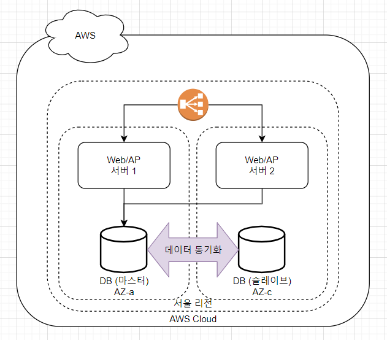
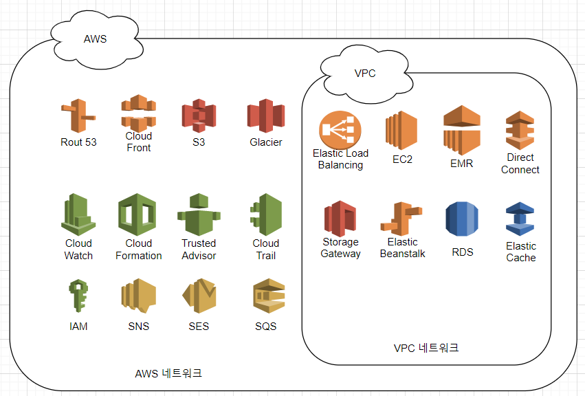

# 1-2 : AWS의 네트워크 서비스

**네트워크는 AWS의 서비스를 지탱하는 가장 중요한 인프라라고 할 수 있다.**

### 리전과 가용 영역
- 리전(Region)
    - AWS는 전세계 13개 지역에서 서비스를 제공하고 있다.
    - 리전에 따라 제공하고 있지 않는 서비스도 존재하지만, 사용할 수 있는 모든 서비스는 모든 지역에서 같은 방법으로 조작할 수 있다.
    - 조작 수단 : AWS console, SDK, CLI
    - 서로 다른 나라에서 가동되는 시스템 인프라를 같은 방법으로 조작할 수 있다는 것은 큰 장점이다.
    - DR은 재해 등이 발생했을 때 시스템을 빠르게 복구하기 위한 구조를 나타낸다.
    - AWS는 여러 개의 리전을 사용한 시스템을 멀티 리전 구성이라고 부른다.
    - 일반적으로 리전은 AWS에서 가동되는 시스테밍르 사용하는 사용자와 최대한 가까운 곳을 선택해서 사용한다.
    - [각 리전에서 사용할 수 있는 서비스](http://aws.amazon.com/ko/about-aws/global-infrastructure/regional-product-services/)
- 가용 영역(Availability Zone : AZ)
    - 데이터 센터와 같은 의미라고 할 수 있다.
    - 중국을 제외한 각각의 리전에는 2개 이상의 AZ가 존재한다.
    - AWS 사용자는 원하는 AZ를 선택하여 시스템을 구축할 수 있다.
    - On Premise 구성으로 구현하기 힘든 여러 개의 데이터 센터를 사용한 시스템 구성 등을 쉽게 구현할 수 있다.
    - AWS는 여러 개의 AZ를 사용한 시스템 구서을 멀티 AZ 구성이라고 부른다.
    - AWS는 서비스를 사용할 때 가용성과 내결함성을 위해 멀티 AZ 구조로 시스템을 구축할 것을 추천한다.
    - 각각의 AZ는 지진과 같은 재해/장애를 고려해서 네트워크 또는 전원 등의 물리적인 인프라가 독립적으로 구성되어 있으므로 특정 AZ에 문제가 발생해도 다른 AZ에 영향을 끼치지 않는다.
- Web+DB 시스템 멀티 AZ 기본 구성
    - 표준적인 Web/AP(웹/어플리케이션) 서버와 DB(데이터베이스) 서버의 멀티 AZ 구성은 아래와 같다.  
        
    - 2대의 Web/AP 서버를 다른 AZ에 배치하고, ELB로 접근을 분산한다.
    - DB 서버는 RDS의 멀티 AZ 옵션을 활성화하면, 2개의 AZ에서 마스터/슬레이브 구성의 DB 서버가 생성되면 데이터가 동기화된다.
    - DB에 장애가 발생하면 자동적으로 마스터 DB와 슬레이브 DB가 교체된다.
    - AWS를 사용해 매우 쉽게 가용성/내결함성이 높은 인프라를 구축할 수 있다.

### Amazon Virtual Private Cloud(VPC)
- VPC
    - Public Cloud 내부에 On Premise 환경과 같은 프라이빗 네티워크를 구성할 수 있게 해주는 서비스이다.
    - 데이터 센터 또는 오프시의 네트워크를 하드웨어 VPN으로 연결하는 인터페이스도 제공한다.
    - VPC를 사용하면 AWS 환경의 인프라 자원을 기존의 네트워크에서 사용하는 것처럼 활용할 수 있다.
    - 인터넷에 접근할 필요가 없는 사내 시스템 등도 보안을 유지한 상태로 AWS로 가동시킬 수 있다.
- Direct Connect
    - 데이터 센터 또는 오피스의 네트워크와 AWS를 전용선으로 접속할 수 있게 해주는 서비스
    - 사용을 원한다면 APN 기술/자문 파트너에게 전용선 접속을 위한 AWS 환경 설정을 의뢰해야 한다.
- EC2-Classic과 EC2-VPC
    - EC2-Classic : 인스턴스를 기동하면 글로벌 IP 주소와 DNS 호스트 이름(FQDN)이 자동적으로 부여되는 구조를 가지고 있다.
    - EC2-VPC : VPC 환경에서 인스턴스를 가동하는 것
    - 2013년 3월 이후에 VPC가 표준 사양이 되어 EC2-Classic은 더 이상 사용할 수 없게 되었다.
    
### Amazon Route 53
- Route 53
    - DNS 서비스
    - AWS의 서비스들끼리 연계할 때는 DNS 호스트 이름(FQDN)을 사용하는 것이 기본이다.
    - AWS로 시스템을 구성할 때는 가능한 고정 정보(IP 주소 또는 호스트 이름)에 의존하지 않는 시스템을 구축해야 확장성과 가용성 높은 시스템을 구축할 수 있다.
- Route 53의 도메인 레지스트라
    - 도메인 구매부터 정보 설정까지 Route 53으로 한번에 관리할 수 있다.
    - 도메인 비용은 일반적인 AWS 사용료에 포함되어 나오므로 따로 지급하지 않아도 된다.
    - [관련 디테일](http://docs.aws.amazon.com/Route53/latest/DeveloperGuide/registrar-tld-list.html)
- 장애 허용 아키텍처
    - 시스템에 이상이 발생한 경우에도 피해를 최소한으로 줄이기 위한 구조를 의미한다.
    - DNS 페일오버(DNS Failover) 아키텍처를 사용하고 있다.
    
### AWS 네트워크와 VPC 네트워크
- AWS 네트워크
    - 인터넷에서 접근할 수 있는 네트워크를 나타낸다.
- VPC 네트워크
    - VPC 환경 내부에서만 사용할 수 있는 닫힌 네트워크를 나타낸다.
- VPC 네트워크로 사용할 수 있는 서비스는 AWS 네트워크에서도 사용할 수 있다.  

- AWS 네트워크와 VPC 네트워크 사이의 통신은 AWS 네트워크 내부에서의 통신으로 취급할 수 있다.
- AWS 네트워크에서만 사용할 수 있는 서비스와 통신할 때 SSH, HTTPS 등의 암호화를 사용할 수 있으므로 위험을 인지하고 제대로 대처하기만 한다면, 도청 등의 보안과 관련된 문제는 따로 없다.